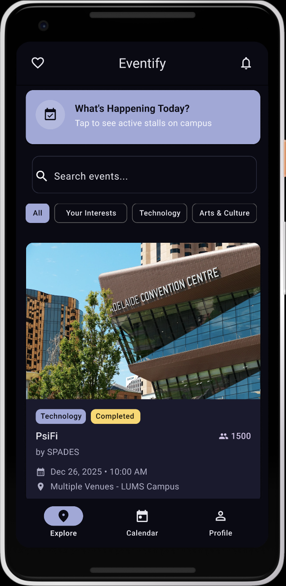
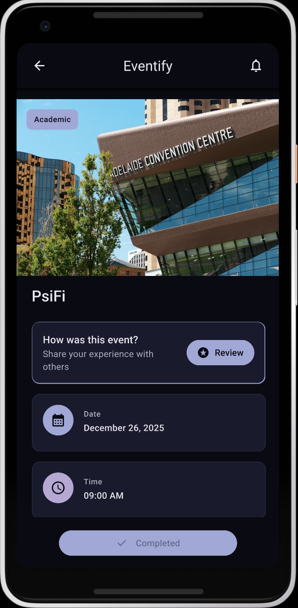
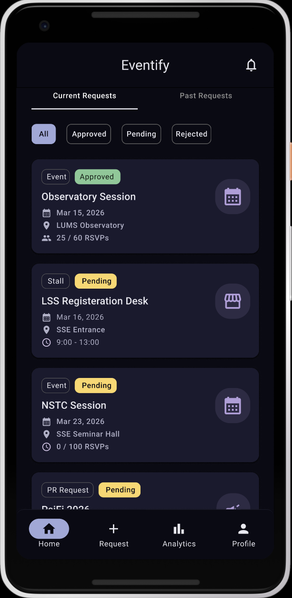
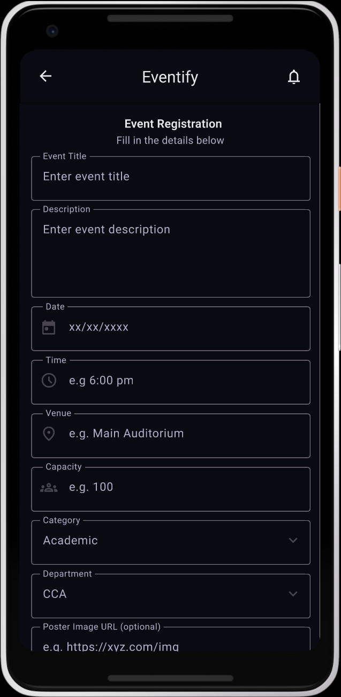
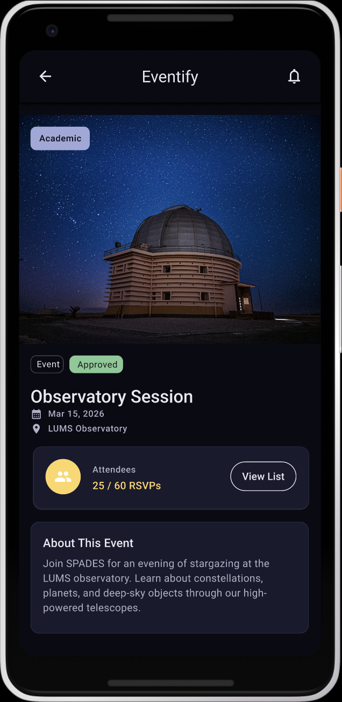

# Project Documentation

## Table of Contents
- [Team Information](#team-information)
- [Weekly Meetings Schedule](#weekly-meetings-schedule)
- [Meeting Minutes](#meeting-minutes)
  - [Meeting – Feb 21, 2026](#meeting--feb-21-2026)
  - [Meeting – March 8, 2026](#meeting--march-8-2026)
- [Object-Oriented Analysis (CRC Cards)](#object-oriented-analysis-crc-cards)
- [UML Diagrams](#uml-diagrams)
- [Product Backlog](#product-backlog)
  - [Project Part 2 -- Preparation](#project-part-2----preparation)
  - [Project Part 3 -- Half-Way Checkpoint](#project-part-3----half-way-checkpoint)
  - [Project Part 4 -- Final Checkpoint](#project-part-4----final-checkpoint)
- [Wireframes & Prototyping](#wireframes--prototyping)
- [Contribution Statements](#contribution-statements)

---

## Team Information
- **Team Name:** softly

| Name                | Roll Number |   GitHub ID  |
|---------------------|-------------|--------------|
| Syed Ramiz Abbas    | 27100440    | sramiza      |
| Muhammad Qasim Ayub | 27100168    | qasimayub    |
| Novera Shahid       | 27100392    | noverashahid |
| Anas Asim Sheikh    | 27100425    | Anas-Lums    |
| Muhammad Usman      | 27100046    | oozeman64    |

---

## Weekly Meetings Schedule

| Day     |       Time        | Duration   |
|---------|-------------------|------------|
| Thursday | 1:10 PM - 2:10 PM | 60 minutes |

---

## Meeting Minutes

### Meeting – Feb 21, 2026

#### Date
Saturday, February 21, 2026

#### Attendance
- Anas
- Novera  
- Qasim  
- Ramiz  
- Usman  

---

#### Key Takeaways
- **Access & Security**: 
  - Transitioned the repository visibility to **Private** to secure project intellectual property.
  - Granted **Read Access** to the instructional team: `abdulali`, `sulemanshahid`, `SafaSalam`, and `abdulbaesit`.
- **Administrative Compliance**: 
  - Confirmed the project topic is successfully locked in on the shared spreadsheet.
  - Established this `Documentation.md` file as the primary repository for team details and meeting minutes, following the TA's guidance on private repo constraints.
- **Workflow Planning**: 
  - Reviewed the sample backlog and wireframe documentation to understand the level of detail required for Part 1.
  - Agreed to move task tracking to the **GitHub Projects** tab to maintain a live Kanban board.
---

#### Prepared Questions & Decisions

- None for now

---

#### General Notes
- Maintain consistent formatting for user stories and storyboards.
- Submit **one main storyboard** (high-level).
- Storyboard does not need to be visually polished.
- Supplementary videos and feature storyboards are allowed.
- Presentation:
  - 10 minutes per group
  - Dataset generated by team
- No strict requirements — apply reasonable design judgment.

---

#### Action Items
- [x] Maintain meeting minutes for every meeting  
- [x] Finalize and document complete storyboard  
- [ ] Align UML diagrams with controller/model guidelines  
- [ ] Implement experiment search in controller  

---

### Meeting – March 8, 2026

#### Date
Sunday, March 8, 2026

#### Attendance
- Anas
- Novera
- Qasim
- Ramiz
- Usman

---

#### Key Takeaways
- **Backlog Completion**: Finalized the entry of all 24 User Stories into the GitHub Issues tracker and the `Documentation.md` file.
- **Workflow Reorganization**: Categorized User Stories into Project Parts 1, 2, and 3 to align with the core MVP, engagement features, and advanced admin functionality.
- **Task Division**: 
  - **Ramiz & Anas**: Responsible for GitHub Project Board setup and Backlog metadata (Risk, Points, Release).
  - **Novera & Usman**: Focused on Figma Wireframing for Student and Organizer flows.
  - **Qasim**: Assigned to the Admin flow and floating support.
- **System Analysis**: Commenced Object-Oriented Analysis by drafting CRC cards to define Model and Controller responsibilities.

---

#### Action Items
- [x] Create GitHub Project Board and import all 24 issues 
- [x] Organize Product Backlog into Project Parts 1, 2, and 3 
- [x] Finalize Student and Organizer wireframes in Figma
- [ ] Draft initial UML Class Diagram based on finalized CRC cards

---
## Object-Oriented Analysis (CRC Cards)

### Core Actors & Entities

| Class Name: `Student` | |
| :--- | :--- |
| **Responsibilities** | **Collaborators** |
| Store personal profile data (name, major, ID). | `SocietyProfile` |
| Track followed societies and user preferences. | `EventCatalog` |
| Submit an RSVP for an upcoming event. | `RSVPManager`, `Event` |
| Manage personal in-app event schedule. | `RSVPManager` |
| Author and submit reviews for attended events. | `ReviewManager`, `Review` |

| Class Name: `SocietyOrganizer` | |
| :--- | :--- |
| **Responsibilities** | **Collaborators** |
| Store society details and executive members. | |
| Draft, edit, and submit new events for approval. | `Event`, `Admin` |
| Request venue bookings and PR items. | `VenueBooking`, `Admin` |
| Schedule announcements and notifications. | `NotificationDispatcher` |
| Scan student QR tickets at the event entrance. | `AttendanceTracker` |

| Class Name: `Admin` | |
| :--- | :--- |
| **Responsibilities** | **Collaborators** |
| Review, approve, or reject pending events. | `Event`, `EventCatalog` |
| Review and resolve venue booking conflicts. | `VenueBooking` |
| Approve campus stall registrations and PR requests. | `Stall`, `SocietyOrganizer` |
| Monitor platform analytics and flag inappropriate reviews. | `ReviewManager` |

| Class Name: `Event` | |
| :--- | :--- |
| **Responsibilities** | **Collaborators** |
| Maintain event state (Draft, Pending, Approved, Rejected). | `Admin` |
| Store core details (title, time, location, description, capacity). | `SocietyOrganizer` |
| Track current RSVP count against maximum capacity. | `RSVPManager` |
| Store associated media (posters, banners). | |

| Class Name: `Review` | |
| :--- | :--- |
| **Responsibilities** | **Collaborators** |
| Store rating score, text feedback, and timestamp. | `Student`, `Event` |

| Class Name: `VenueBooking` | |
| :--- | :--- |
| **Responsibilities** | **Collaborators** |
| Store requested time slots, required equipment, and location. | `Event`, `SocietyOrganizer` |
| Track approval status and prevent double-booking. | `Admin` |

| Class Name: `Stall` | |
| :--- | :--- |
| **Responsibilities** | **Collaborators** |
| Store stall details (location, operating hours, purpose). | `SocietyOrganizer` |
| Track Admin approval status for campus activation. | `Admin` |

### Core Controllers & Managers

| Class Name: `EventCatalog` | |
| :--- | :--- |
| **Responsibilities** | **Collaborators** |
| Retrieve and display the feed of approved events. | `Event` |
| Filter events by category, society, date, and location. | `Event`, `Student` |
| Calculate and display trending events based on RSVP velocity. | `Event`, `RSVPManager` |

| Class Name: `RSVPManager` | |
| :--- | :--- |
| **Responsibilities** | **Collaborators** |
| Verify available capacity before confirming an RSVP. | `Event` |
| Update the event's attendee list. | `Event`, `Student` |
| Sync the confirmed event to the student's in-app schedule. | `Student` |

| Class Name: `AttendanceTracker` | |
| :--- | :--- |
| **Responsibilities** | **Collaborators** |
| Generate a unique QR code ticket when a student RSVPs. | `RSVPManager`, `Student` |
| Verify scanned ticket validity and prevent duplicate check-ins. | `Event`, `RSVPManager` |
| Update the actual attendance count for the event analytics. | `Event` |

| Class Name: `NotificationDispatcher` | |
| :--- | :--- |
| **Responsibilities** | **Collaborators** |
| Trigger automated alerts to followers when a society posts an event. | `SocietyOrganizer`, `Student` |
| Send scheduled reminders to users who have RSVP'd. | `Event`, `Student` |
| Alert organizers when an event/venue is approved or rejected. | `Admin`, `SocietyOrganizer` |

| Class Name: `ReviewManager` | |
| :--- | :--- |
| **Responsibilities** | **Collaborators** |
| Verify a student actually attended before allowing a review. | `AttendanceTracker`, `Student` |
| Calculate the aggregate rating for an event or society. | `Event`, `Review` |
---

## UML Diagrams
_Add UML diagrams here or link images from the repository._

---

## Product Backlog

### Project Part 0
_Repository setup and administrative requirements completed._

### Project Part 1
_Initial project pitch and topic selection completed._

### Project Part 2 -- Preparation
_Current Phase: Object-Oriented Analysis, Backlog generation, and Wireframing._

### Project Part 3 -- Half-Way Checkpoint

| ID | Feature | User Story | Priority | Risk Level | Story Points | Status |
|:---|:---|:---|:---|:---|:---|:---|
| **US-01** | Browse Event Feed | As a student, I want to browse a centralized feed of campus events so that I can easily discover activities happening across campus. | High | Low | 5 | To Do |
| **US-02** | Filter by Category | As a student, I want to filter events by category (technology, arts & culture, etc.) so that I can quickly find events relevant to me. | High | Low | 3 | To Do |
| **US-04** | Sort Events by Date | As a student, I want to view a chronological schedule of upcoming events so that I can see exactly what is happening on campus today and later this week. | High | Low | 3 | To Do |
| **US-05** | View Event Details | As a student, I want to open an event page with detailed information (description, time, venue, organizer, media) so that I can decide whether to attend. | High | Low | 5 | To Do |
| **US-06** | RSVP to Events | As a student, I want to RSVP to events so that I can secure my spot and guarantee my entry. | High | Medium | 5 | To Do |
| **US-07** | In-App Calendar | As a student, I want events I RSVP to appear in my in-app calendar so that I can keep track of upcoming events. | Medium | Medium | 5 | To Do |
| **US-08** | Event Notifications | As a student, I want to receive notifications about events from societies or categories I follow so that I stay updated about relevant activities. | High | Medium | 5 | To Do |
| **US-09** | Follow Societies | As a student, I want to follow societies so that I automatically receive updates about their events. | High | Low | 3 | To Do |
| **US-13** | Create Event | As a society organizer, I want to create an event by submitting details such as description, poster, schedule, and speakers so that it can be listed on the platform. | High | Medium | 5 | To Do |
| **US-14** | Edit Event | As a society organizer, I want to edit event details so that I can update information if something changes. | High | Low | 3 | To Do |
| **US-20** | Approve or Reject Events | As an Admin, I want to approve or reject submitted event requests so that only verified events appear on the platform. | High | Low | 3 | To Do |

 

### Project Part 4 -- Final Checkpoint

| ID | Feature | User Story | Priority | Risk Level | Story Points | Status |
|:---|:---|:---|:---|:---|:---|:---|
| **US-03** | QR Code Attendance | As a society organizer, I want to assign QR code tickets to students and scan them at the venue so that I can quickly and accurately track actual attendance. | Medium | High | 8 | To Do |
| **US-10** | Leave Event Reviews | As a student, I want to leave a review after attending an event so that I can share feedback with other students. | Medium | Low | 3 | To Do |
| **US-11** | View Campus Stalls | As a student, I want to see a page showing active stalls on campus today so that I know what is happening around campus. | Medium | Medium | 5 | To Do |
| **US-12** | Monitor Events | As an Admin, I want to monitor attendance statistics and event reviews so that I can ensure events comply with campus standards. | Medium | Medium | 5 | To Do |
| **US-15** | View Event Analytics | As a society organizer, I want to view RSVP counts and attendance statistics so that I can measure event engagement. | Medium | Medium | 5 | To Do |
| **US-16** | Schedule Notifications | As a society organizer, I want to schedule announcement and reminder notifications for attendees so that they are informed about the event. | Medium | Medium | 5 | To Do |
| **US-17** | Register Campus Stall | As a society organizer, I want to register a campus stall with description, location, and timing so that students can discover it. | Medium | Medium | 5 | To Do |
| **US-18** | Venue Booking Request | As a society organizer, I want to submit venue booking requests with required equipment so that my event can be hosted in an appropriate space. | High | High | 8 | To Do |
| **US-19** | Manage Venues | As an Admin, I want to manage venue availability and resolve booking conflicts so that events are scheduled properly. | High | Medium | 5 | To Do |
| **US-21** | Approve Stalls | As an Admin, I want to approve or reject stall registration requests so that campus activations are regulated. | Medium | Low | 3 | To Do |
| **US-22** | Review PR Requests | As an Admin, I want to review PR item requests from societies so that purchases follow institutional guidelines. | Medium | Medium | 5 | To Do |

---

## Wireframes & Prototyping

### Interactive Figma Prototype
The complete system design and interactive prototype can be accessed via the link below. The prototype is organized into three distinct user flows: **Student**, **Organiser**, and **Admin**.

[**View Interactive Figma Prototype**](https://www.figma.com/design/cCayjvWta2xG0mhlfgbxj5/Softly-Design?node-id=0-1&p=f&t=CNUDDUadMb5MBYAj-0)

---

### Prototype Navigation Guide
To ensure a smooth review, we have structured the Figma file into the following key journeys:

#### 1. Student Flow (Core Experience)
- **Key Features**: Browsing the event feed, category filtering, chronological sorting, and the RSVP process.
- **Starting Point**: Navigate to the frames under the "Student Portal" section.
- **User Stories Covered**: US-01, US-02, US-04, US-05, US-06.

#### 2. Organiser Flow (Event Management)
- **Key Features**: Creating new events, editing existing listings, venue booking, and QR attendance tracking.
- **Starting Point**: Locate the "Organiser Portal" frames.
- **User Stories Covered**: US-13, US-14, US-18, US-03.

#### 3. Admin Flow (Governance)
- **Key Features**: Reviewing event requests, approving/rejecting stall registrations, and PR item oversight.
- **Starting Point**: Locate the "Admin Portal" frames in the bottom cluster.
- **User Stories Covered**: US-20, US-21, US-22.

---

### Wireframe Screenshots
> **Note on Implementation:** The screenshots below represent only a fraction of the full system design. The complete interactive prototype—including all state changes, edge cases, and the full Student, Organiser, and Admin user journeys—can be explored via the [Interactive Figma Link](#interactive-figma-prototype) provided above.

#### High-Fidelity Wireframes

| Student Event Feed | Student Event Details |
|:---:|:---:|
|  |  |
| *Figure 1: Event feed (US-01, US-02)* | *Figure 2: Event details (US-05, US-10)* |

 

| Organiser Dashboard | Event Registration |
|:---:|:---:|
|  |  |
| *Figure 3: Organiser requests (US-14, US-20)* | *Figure 4: Event creation (US-13)* |

 

| Organiser Attendance Tracking |
|:---:|
|  |
| *Figure 5: RSVP tracking and attendee list (US-15, US-03)* |

## Contribution Statements

**Qasim:**
* Primarily worked on the Student Flow in Figma, creating and refining frames and adding interactions to simulate the user journey.
* Made UI consistency fixes in the Admin flow and implemented the attendance functionality in the Organiser flow, along with additional UI adjustments.
* Suggested modifications and improvements to the User Stories based on Figma practicality.
* Worked with the team to decide on additional features.

**Novera:**
* Led the development of the Admin Flow in Figma, creating the main frames and interactions.
* Expanded the Student Flow by designing and integrating the Student Dashboard category flow.
* Suggested modifications and improvements to the User Stories based on Figma practicality.
* Worked with the team to decide on additional features.

**Usman:**
* Planned the Admin Flow, making a design-ready plan for how Admins would interact with the app.
* Focused on the Organiser Flow in Figma, creating and refining frames to represent the organiser-side workflow.
* Suggested modifications and improvements to the User Stories based on Figma practicality.
* Worked with the team to decide on additional features.

**Ramiz:**
* Migrated the project to a private repository and managed team-wide access for collaborators and TAs.
* Configured the GitHub Project Board with automated Kanban workflows and structured all 22 User Stories into phased releases (Parts 1–4).
* Authored the CRC (Class-Responsibility-Collaborator) cards to establish the Model-Controller architecture and backend logic.
* Assisted in the Organiser Flow development in Figma by wiring interactive UI components and buttons to create a navigable prototype.

**Anas:**
* Co-authored the Object-Oriented Analysis via CRC cards, detailing class responsibilities, collaborators, and system logic.
* Collaborated on the GitHub integration by structuring the comprehensive Product Backlog and converting all User Stories into fully labeled, tracked issues.
* Contributed to the Organiser Flow in Figma, assisting with layout and structural design.
* Conducted testing and logical analysis across all Figma prototypes to ensure seamless navigation, usability, and requirement traceability.
